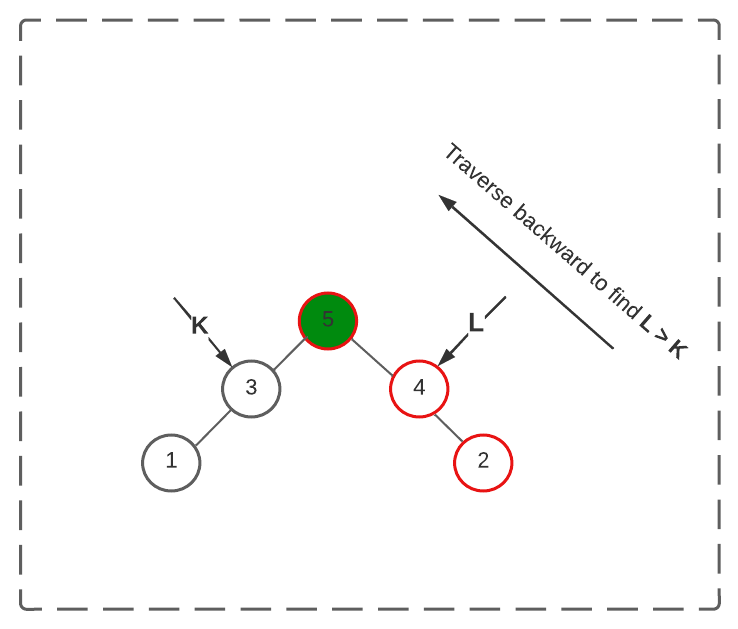
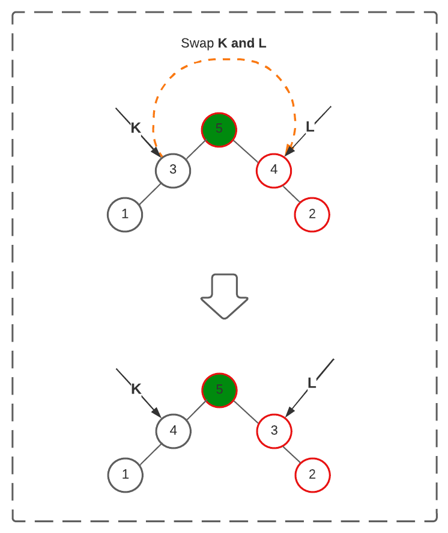

# Description

Given an array Arr[] of integers, rearrange the numbers of the given array into the lexicographically next greater permutation of numbers.

If such an arrangement is not possible, it must rearrange it as the lowest possible order (i.e., sorted in ascending order).

[Source](https://takeuforward.org/data-structure/next_permutation-find-next-lexicographically-greater-permutation/)
[Leetcode](https://leetcode.com/problems/next-permutation/)

Example 1 :

```javascript
Input format: Arr[] = {1,3,2}

Output: Arr[] = {2,1,3}

Explanation: All permutations of {1,2,3} are {{1,2,3} , {1,3,2}, {2,13} , {2,3,1} , {3,1,2} , {3,2,1}}. So, the next permutation just after {1,3,2} is {2,1,3}.
```

Example 2:

```javascript
Input format: Arr[] = {3,2,1}

Output: Arr[] = {1,2,3}

Explanation: As we see all permutations of {1,2,3}, we find {3,2,1} at the last position. So, we have to return the topmost permutation.
```

## Solution

Intuition lies behind the lexicographical ordering of all possible permutations of a given array. There will always be an increasing sequence of all possible permutations when observed.

### Step 1

Linearly traverse array from backward such that k-th index value of the array is less than (k+1)th index value. Store that index in a variable.


If the index value received from step 1 is less than 0. This means the given input array is the largest lexicographical permutation. Hence, we will reverse the input array to get the minimum or starting permutation.

### Step 2

Linearly traverse array from backward. Find an index that has a value greater than the previously found index. Store index is another variable.



### Step 3

Swap values present in indices found in the above two steps.



### Step 4

Reverse array from index+1 where the index is found at step 1 till the end of the array.


