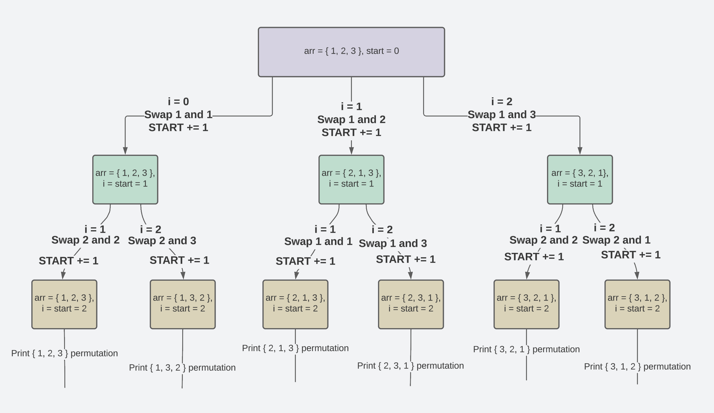

### Permutations

> A permutation also called an “arrangement number” or “order,” is a rearrangement of the elements of an ordered list S into a one-to-one correspondence with S itself. A string of length N has N! permutations.

Examples:

```javascript
Input: arr = [1, 2, 3]
Output: [[1, 2, 3], [1, 3, 2], [2, 1, 3], [2, 3, 1], [3, 2, 1], [3, 1, 2]]
```



```javascript
Input: S = “ABC”
Output: “ABC”, “ACB”, “BAC”, “BCA”, “CBA”, “CAB”

Input: S = “XY”
Output: “XY”, “YX”
```

[Source](https://www.geeksforgeeks.org/write-a-c-program-to-print-all-permutations-of-a-given-string/)


