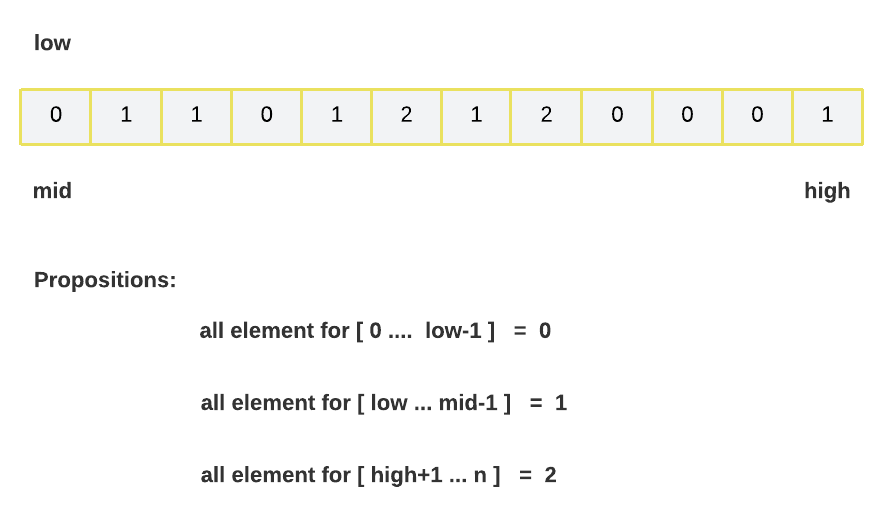
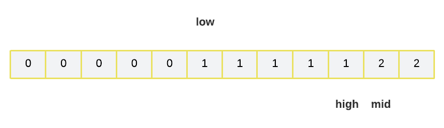

# Dutch National flag algorithm: O(N)

## Problem Statement

Given an array consisting of only 0s, 1s and 2s. Write a program to in-place sort the array without using inbuilt sort functions. ( Expected: Single pass-O(N) and constant space)

Example 1:

```javascript
Input: nums = [2,0,2,1,1,0]
Output: [0,0,1,1,2,2]

Input: nums = [2,0,1]
Output: [0,1,2]

Input: nums = [0]
Input: nums = [0]
```

## Intuition

In this approach, we will be using 3 pointers named low, mid, and high. We will be using these 3 pointers to move around the values. The primary goal here is to move 0s to the left and 2s to the right of the array and at the same time all the 1s shall be in the middle region of the array and hence the array will be sorted.



```python
    low = 0
    mid = 0
    high = len(arr) - 1
    while mid <= high:
        if arr[mid] == 0:
            arr[low], arr[mid] = arr[mid], arr[low]
            low += 1
            mid += 1
        elif arr[mid] == 1:
            mid += 1
        elif arr[mid] == 2:
            arr[mid], arr[high] = arr[high], arr[mid]
            high -= 1
```


